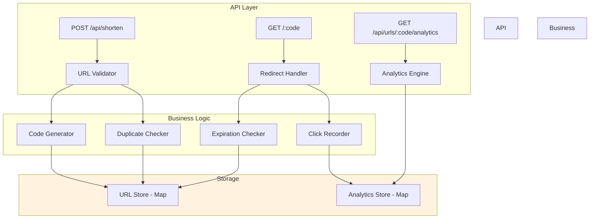
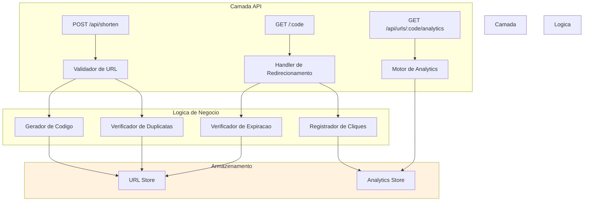

# JavaScript URL Shortener

REST API service for creating and resolving shortened URLs with click analytics, custom codes, expiration support, and pagination.

[English](#english) | [Portugues](#portugues)

---

## English

### Overview

A Node.js/Express URL shortening service that converts long URLs into short, shareable links. Features include custom short codes, configurable expiration, click tracking with analytics, duplicate detection, and a paginated listing endpoint.

### Architecture



### Features

- URL shortening with SHA-256 based code generation
- Custom short codes with validation
- Configurable URL expiration (TTL in seconds)
- Duplicate URL detection and reuse
- Click analytics with user agent, referer, and timestamp
- 301 redirect for short URL resolution
- Paginated URL listing endpoint
- URL deletion support
- Health check endpoint

### API Endpoints

| Method | Endpoint | Description |
|--------|----------|-------------|
| POST | /api/shorten | Create a short URL |
| GET | /:code | Redirect to original URL |
| GET | /api/urls | List all URLs (paginated) |
| GET | /api/urls/:code | Get URL details |
| GET | /api/urls/:code/analytics | Get click analytics |
| DELETE | /api/urls/:code | Delete a short URL |
| GET | /api/health | Health check |

### Quick Start

```bash
git clone https://github.com/galafis/JavaScript-URL-Shortener.git
cd JavaScript-URL-Shortener
npm install
npm start
```

### Tech Stack

| Technology | Purpose |
|------------|---------|
| Node.js | Runtime environment |
| Express.js | HTTP server framework |

### License

MIT License - see [LICENSE](LICENSE) for details.

### Author

**Gabriel Demetrios Lafis**
- GitHub: [@galafis](https://github.com/galafis)
- LinkedIn: [Gabriel Demetrios Lafis](https://linkedin.com/in/gabriel-demetrios-lafis)

---

## Portugues

### Visao Geral

Servico de encurtamento de URLs em Node.js/Express que converte URLs longas em links curtos e compartilhaveis. Inclui codigos curtos personalizados, expiracao configuravel, rastreamento de cliques com analytics, deteccao de duplicatas e endpoint de listagem paginada.

### Arquitetura



### Funcionalidades

- Encurtamento de URLs com geracao de codigo baseada em SHA-256
- Codigos curtos personalizados com validacao
- Expiracao configuravel de URLs (TTL em segundos)
- Deteccao e reutilizacao de URLs duplicadas
- Analytics de cliques com user agent, referer e timestamp
- Redirecionamento 301 para resolucao de URLs curtas
- Listagem paginada de URLs
- Suporte a exclusao de URLs
- Endpoint de verificacao de saude

### Inicio Rapido

```bash
git clone https://github.com/galafis/JavaScript-URL-Shortener.git
cd JavaScript-URL-Shortener
npm install
npm start
```

### Licenca

Licenca MIT - veja [LICENSE](LICENSE) para detalhes.

### Autor

**Gabriel Demetrios Lafis**
- GitHub: [@galafis](https://github.com/galafis)
- LinkedIn: [Gabriel Demetrios Lafis](https://linkedin.com/in/gabriel-demetrios-lafis)
